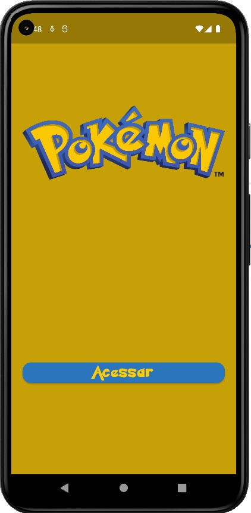
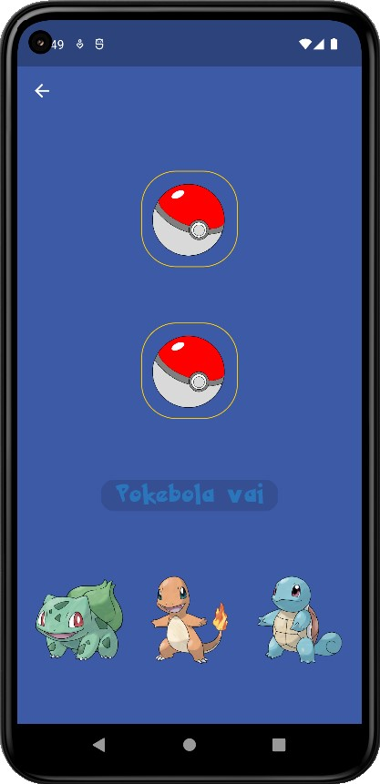
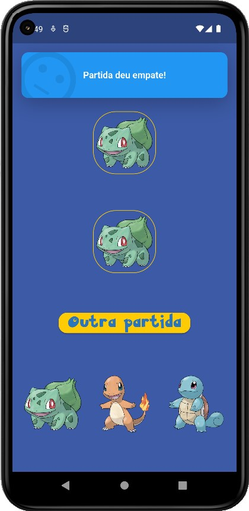
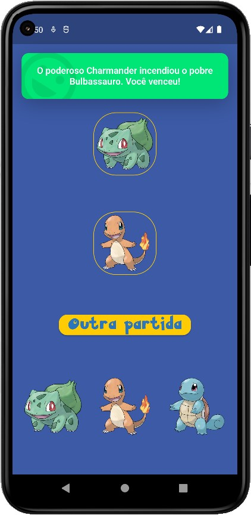
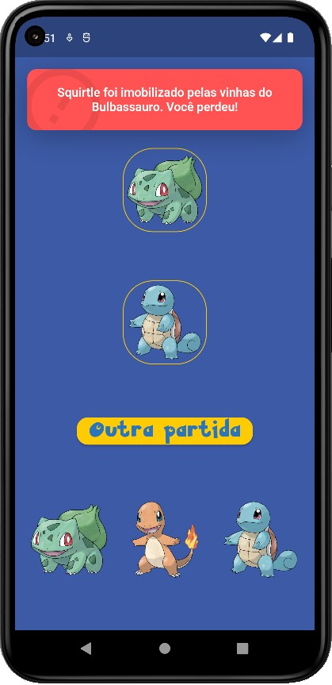
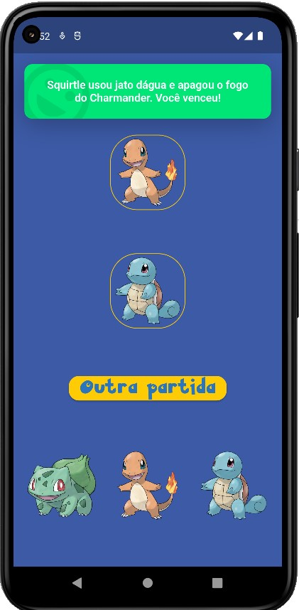

# jo_ken_pokemon
=================
O aplicativo jo-ken-pokemon é um jogo que permite ao usuário escolher qual pokemon deseja utilizar em um duelo contra um inimigo de inteligência artificial simples. A proposta simples de duelo entre pokemons dos tipos planta, fogo e água, cria uma perspectiva cíclica onde cada um possui uma fraqueza e uma vantagem, semelhante ao jogo jo-ken-po.

# Especificações Técnicas

- **Dart:** 2.18.6
- **Flutter:** 3.3.10

# Funcionamento

